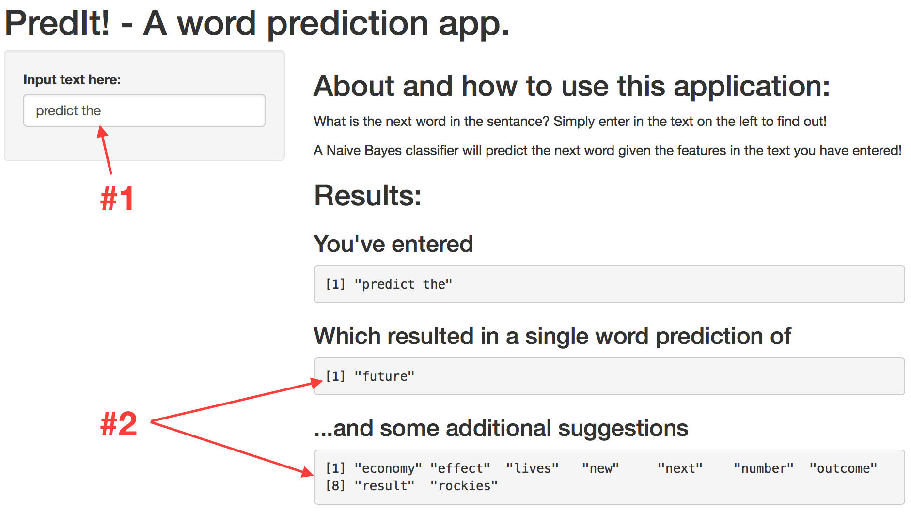

PredIt! - a word predictor 
========================================================
author: BVoorhees
date: August 23, 2015
---
output:
  slidy_presentation:
    font_adjustment: -2
---
Introduction, description, and functionality
========================================================
Every day, millions (if not billions) of people around the world want to think and type as little as possible.

This app solves that problem by providing: 

- Predictions and reccomendations for the next word in a phrase provided by the user — in real time!
- An easy to use interface
- A lean model that requires a small amount of data and processing time to give predictions and suggestions from millions of data points.

User experience (instructions for use)
========================================================

 
### The user only has to:

1. Enter in a string of text on the left hand side ***(no need to click "submit"/"enter"/"ok"!)***.  
2. Look to the right and see one predicted word, and several suggested ones.

***

What it requires + how it works:
========================================================
 
 
#### Requirements:

The application requires four R packages to be initiated (`shiny`,`data.table`, `tm` and `e1071`), and one dataset consisting of multiple ngram dataframes. The dataset has been converted to lower case characters and cleaned for profanity, punctuation, excessively repeated words, and whitespace. 

How it works: the algorithm
========================================================
#### Mechanics and explanation of algorithm:
<small>
After the applciation has been initiated, the user can input a string of text, at which point the application:

1. Strips the phrase of punctuation and converts to lower case characters.  
2. Breaks the phrase apart, and searches through `n`gram corpora to find matches for the trailing `n-1` words in the prhase. Matching `n`grams are broken into (1) a matrix of `n-1` words and a (2) vector of the matching `n`th word.  
3. Uses a naive bayes model in the `e1701` package to calculate conditional probabilities for the `nth` word given the `n-1` words.   
4. Probabilities are weighted according to the length of `n` (giving more preference to specific matches), sorted from most likely to least. The user is left with the most likely following word as well as several suggestions. 

This entire process takes 3.7 seconds or less a 2.4GHZ Intel core i5 with 8GB of memory. It is even faster on a webserver.
</small>

